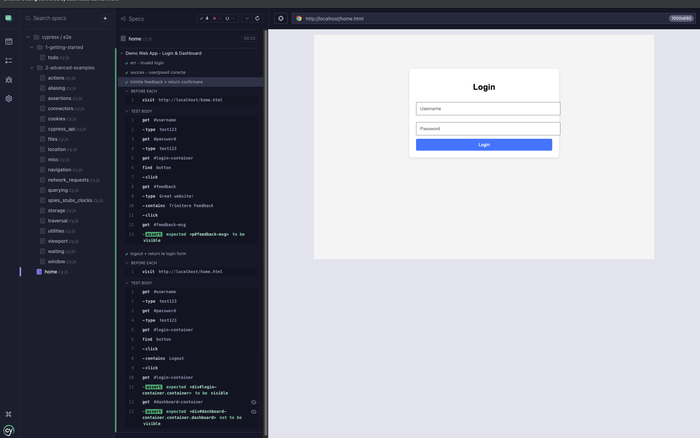
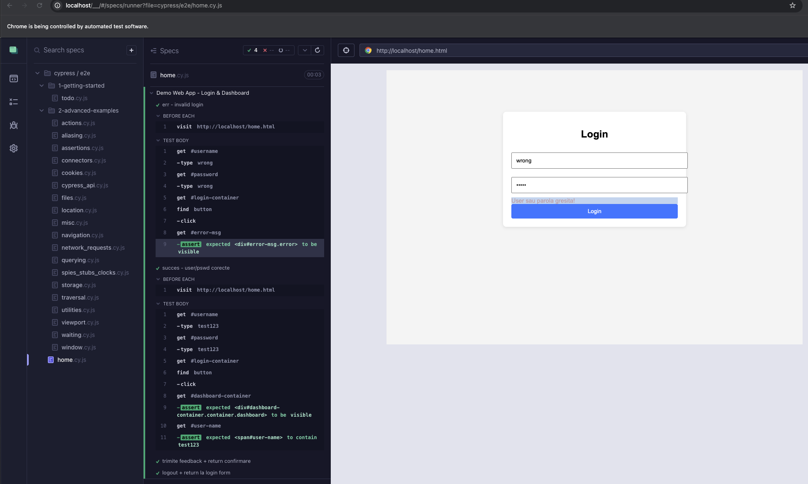
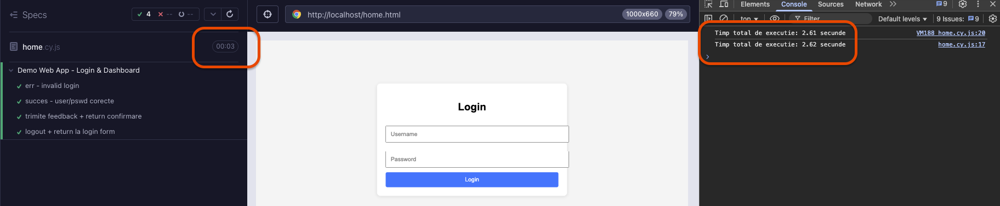
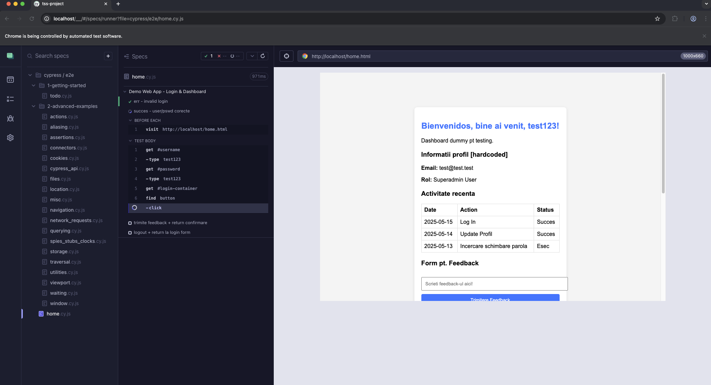
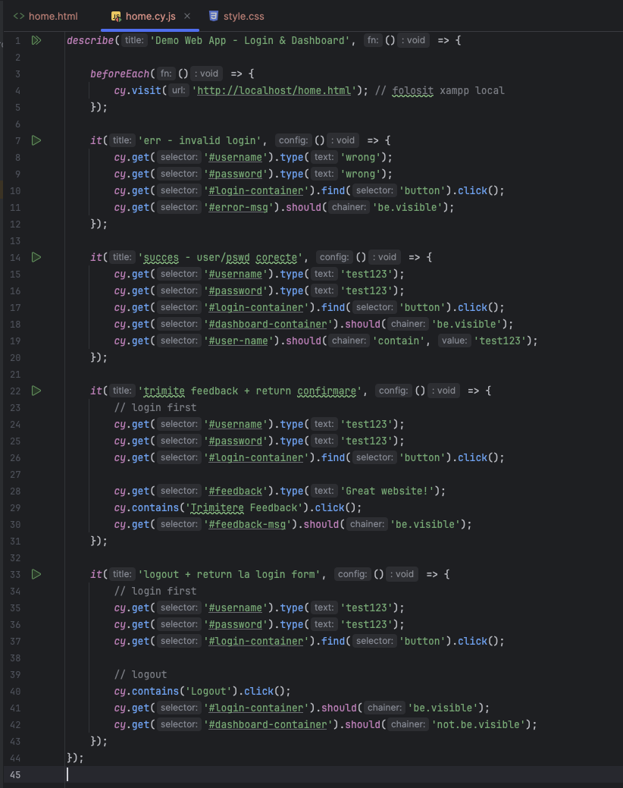
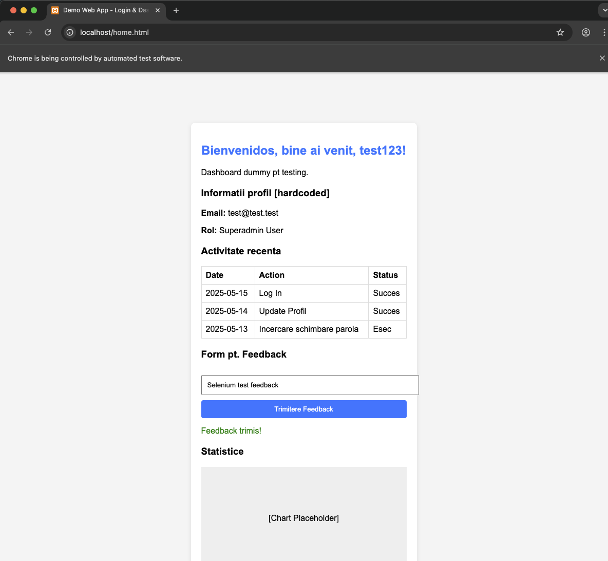
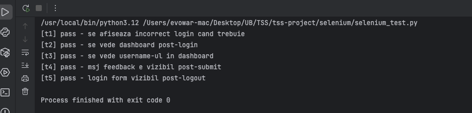
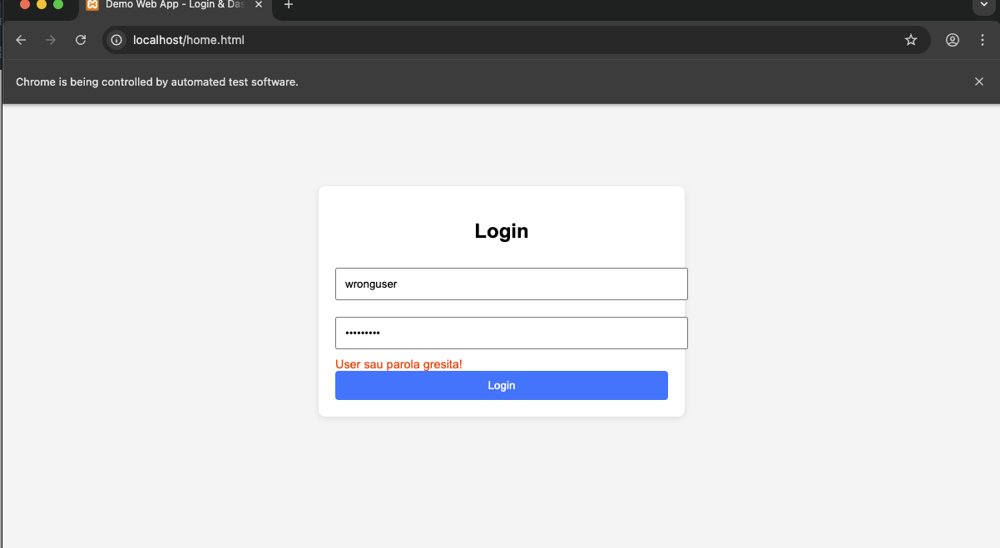
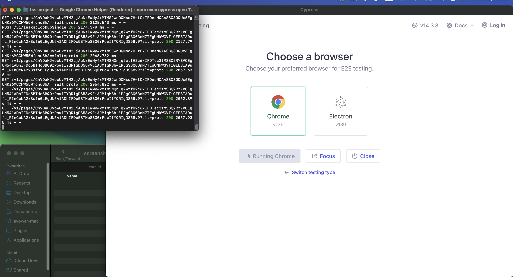

<h1>Proiect - [T6] Testarea Interfetei Grafice A Unei Aplicatii Web</h1>

<h3>Cerinta: </h3>
- "Să se realizeze un studiu comparativ a cel puţin 2 framework-uri de testare, evidențiindu-se
utilitatea şi ușurința în folosire a fiecăruia. Pe baza unor exemple de cod, se vor evidenția
diferențele dintre tool-uri."
- "Folosiți un framework pentru a realiza teste ale interfeței grafice a unei aplicații web (teste
de funcționalitate, navigare, validare formular, compatibilitate browser et al.). Motivați alegerea
făcută."

<h3>Tehnologii folosite: </h3>
- NPM Framework pentru testare
- Cypress
- Selenium
- Python (limbaj principal de programare)
- JavaScript, HTML
- XAMPP (webhosting local)
- MySQL (via XAMPP) - nefolosit momentan

## I. Introducere
Acest proiect are ca scop testarea interfetei grafice a unei aplicatii web simple, folosind doua framework-uri de automatizare: **Cypress** si **Selenium**.
Obiectivul a fost realizarea unui studiu comparativ intre cele doua unelte, evidentind diferentele de utilizare, eficienta si complexitate. In plus, am implementat efectiv teste automate pentru o aplicatie statica, simuland scenarii reale de login, validarea unui formular, navigare si logout.

## II. Tehnologii folosite si motivatie
- **Cypress (JavaScript)** - ales pentru simplitatea instalarii, viteza de executie si suportul pentru testare a interfetelor grafice.
- **Selenium (Python)** - ales pentru ca este un standard in industrie si suporta cam orice browser.
- **HTML/CSS/JavaScript** - aplicatie statica (fara backend), pentru a evidentia doar partea de testare UI & interactiuni front-end.
- **XAMPP** - utilizat pentru a organiza si gestiona fisierele HTML locale, simuland un server real.

Am mers pe abordarea simplista a unei pagini statice cu script-uri JS pentru a intelege si ilustra clar diferentele dintre cele doua framework-uri de testare.

## III. Detalii tehnice
Am creat o pagina web `home.html` insotita de un fisier tip css pentru design. Pagina `home.html` contine urmatoarele:
- form pentru login
- un dashboard hardcoded pentru afisare informatii despre user
- tabel de activitati recente
- form pentru feedback
- butoane de navigare, precum logout

### Implementarea testelor
Pentru teste, am folosit Cypress si Selenium.
Testele create sunt:
- Selenium: 
- Cypress: 

### Metrici comparative
1. Timp de executie a testului
2. Marimea codului
3. Dependinte
4. Capabilitati de stand-alone
5. Complexitate
6. Eficienta (incl. debug)

| **Metrica**       | **Cypress**                                                                  | **Selenium**                                                                   | **Observations**                                                                                             |
|-------------------|------------------------------------------------------------------------------|--------------------------------------------------------------------------------|--------------------------------------------------------------------------------------------------------------|
| **Timp executie** | _aprox. 3 sec_                                                               | _aprox. 2 sec_                                                                 | Selenium mult mai rapid in cazul de fata                                                                     |
| **Dimens. cod**   | _aprox. 60 linii de cod_                                                     | _aprox. 90 linii de cod_                                                       | Cod mai ergonom in Cypress                                                                                   |
| **Dependinte**    | Node.js, Cypress pkg, npm                                                    | Python, Selenium pkg, drivere (i.e. ChromeDriver)                              | Selenium functioneaza mai mult ca un stand-alone, in timp ce Cypress are mai multe stagii si functionalitati |
| **Standalone**    | Ruleaza cu tester intern, are interfata proprie, nu necesita drivere externe | Necesita drivere externe si librarii dedicate                                  | Cypress consuma mai mult spatiu, dar e mai dotat dpdv standalone                                             |
| **Complexitate**  | Mai dificil la prima vedere fata de Selenium                                 | Cod mai usor de inteles si urmarit, la prima vedere mai simplu fata de Cypress | Cypress are mai multe optiuni; Selenium este mai simplu si pare si CLI-oriented                              |
| **Eficienta**     | Ofera functionalitati de debug avansate                                      | Nu ofera prea multe dpdv debug                                                 | Cypress castiga la features in zona de debugging                                                             |

### Observatii personale
- Selenium a fost mult mai rapid in executie
- Cypress are mult mai multe features
- Selenium este mai usor de utilizat la o prima vedere
- Cypress este mai flexibil si mai detaliat odata ce e inteles
- Pentru proiecte simple, Selenium pare sa fie mai la indemana

Se pot vedea in screenshot-uri atat timpii de executie, cat si rularile cu succes sau cu fail.

[//]: # (![ss]&#40;screenshots/cypress-feedback+logout.png&#41;)

[//]: # (![ss]&#40;screenshots/cypress-invalid-login+good-login.png&#41;)

[//]: # (![ss]&#40;screenshots/cypress-logged-execution-time.png&#41;)

[//]: # (![ss]&#40;screenshots/cypress-ongoing-testing.png&#41;)

[//]: # (![ss]&#40;screenshots/cypress-test-code.png&#41;)

[//]: # (![ss]&#40;screenshots/selenium-good-login.png&#41;)

[//]: # (![ss]&#40;screenshots/selenium-terminal-output.png&#41;)

[//]: # (![ss]&#40;screenshots/selenium-wrong-login.png&#41;)

[//]: # (![ss]&#40;screenshots/terminal-cypress.png&#41;)

<table>
  <tr>
    <td></td>
    <td></td>
    <td></td>
  </tr>
  <tr>
    <td></td>
    <td></td>
    <td></td>
  </tr>
  <tr>
    <td></td>
    <td></td>
    <td></td>
  </tr>
</table>

## IV. Raport AI legat de timpul testarii
In timpul scrierii testelor de Cypress, am folosit Copilot. Pe langa asistenta automata (precum sugestia de cod predictiva), Copilot m-a ajutat sa traduc idei din alte limbaje (Python) in JavaScript, plus sa folosesc metodele default Cypress.
Aceste lucruri au facut procesul de testare sa fie mai rapid, eliminand timpul de cautare al unui programator (eu) pe Google, prin documentatie oficiala sau prin alte surse, cautand solutii sau sintaxa/metode/parametri.

## V. Concluzii
Am realizat cu succes un proiect de testare a interfetei grafice web, lucru pe care nu l-am mai facut pana acum si ma bucur ca m-am intersectat cu aceasta zona a programarii.
Legat de cele doua framework-uri folosite, consider ca Selenium este bun pentru proiecte mai mici, dar Cypress are mai mult potential daca e folosit la maxim.
Selenium a fost mai eficient si rapid pentru acest tip de aplicatie simpla, in timp ce Cypress ramane important pentru compatibilitate extinsa, scalabilitate, specificitate etc.
Proiectul mi-a oferit o perspectiva clara asupra avantajelor celor doua framework-uri, in context de testare UI si a functionalitatii.

## VI. Bibliografie
- [1] Selenium: https://selenium-python.readthedocs.io/
- [2] Cypress: https://docs.cypress.io/
- [3] Sintaxa si metode JavaScript: https://devdocs.io/javascript/
- [4] Instalare Selenium: https://medium.com/@mintholic1/installing-selenium-webdriver-on-your-mac-1ef5fec7efda
- [5] Instalare Cypress: https://docs.cypress.io/app/get-started/install-cypress
- [6] Generari Copilot: https://copilot.microsoft.com, Data generării: 16 Mai 2025